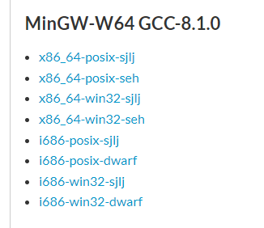
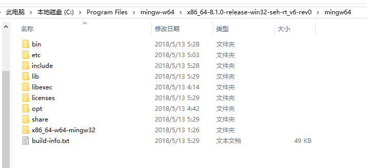
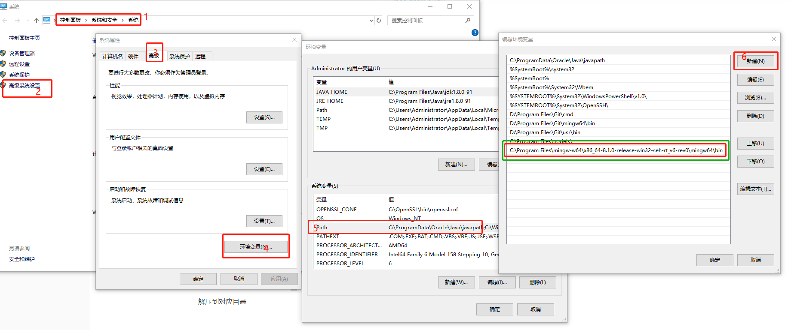
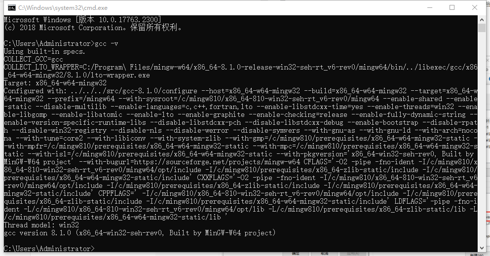

# 安装gcc

## windows（mingw）

MinGW 的全称是：Minimalist GNU on Windows 。它实际上是将经典的开源 C语言 编译器 GCC 移植到了 Windows 平台下，并且包含了 Win32API ，因此可以将源代码编译为可在 Windows 中运行的可执行程序。而且还可以使用一些 Windows 不具备的，Linux平台下的开发工具。一句话来概括：MinGW 就是 GCC 的 Windows 版本 。

### 下载

下载地址：https://sourceforge.net/projects/mingw-w64/files/

**文件名结构：系统架构-接口协议-异常处理模型**

- 系统架构：安装电脑的架构。64位的选择x86_64；32位的选择i686；
- 接口协议：开发 Windows 程序选择 win32；开发 Linux、Unix、Mac OS 等其他操作系统下的程序选择 posix；
- 异常处理模型：异常处理在开发中非常重要，在开发的过程中，大部分的时间会耗在处理各种异常情况上。seh 是新发明的，而 sjlj 则是古老的。seh 性能比较好，但不支持 32位。 sjlj 稳定性好，支持 32位。建议64位操作系统选择seh。（暂时还不懂，我选择的seh）

**根据需求下载对应文件**

### 安装

解压到对应目录

添加环境变量

### 验证

打开一个新的cmd窗口输入`gcc -v` 类似上图显示则安装完成（上图版本为8.1.0）