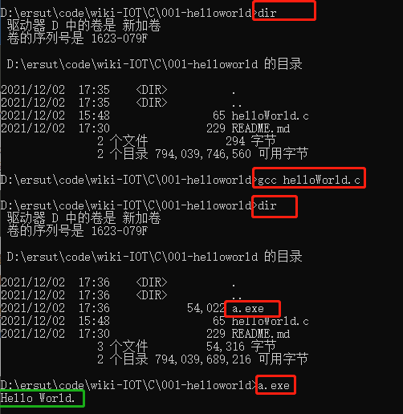
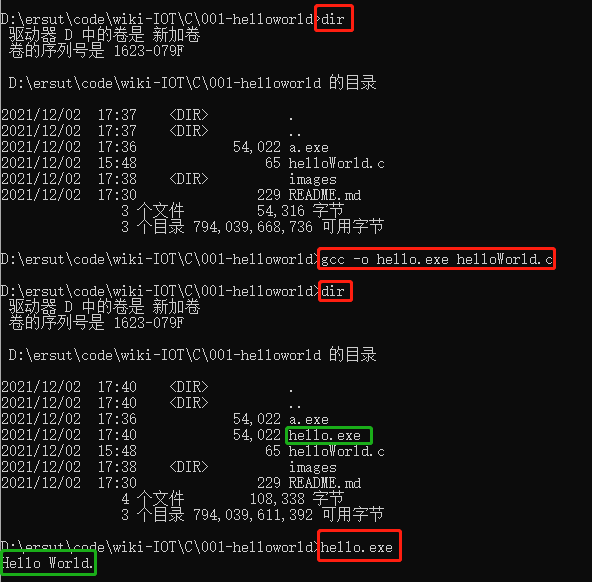

# Hello World

## 代码

文件：[helloWorld.c](./helloWorld.c)

```c
#include <stdio.h>

void main(){
	printf("Hello World.\n");
}
```


## 编译

helloWorld.c只是 **源文件** 需要通过编译器（GCC）便以为可运行的二进制代码。



执行 `gcc helloWorld.c` 将生成一个`a.exe`(windows下)的文件

执行 `a.exe`屏幕输出 `Hello World.`

### 指的编译后文件的名称



执行 `gcc -o hello.exe helloWorld.c` 将生成一个`hello.exe`(windows下)的文件

执行 `hello.exe`屏幕输出 `Hello World.`

