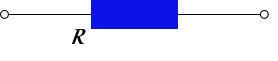
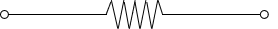
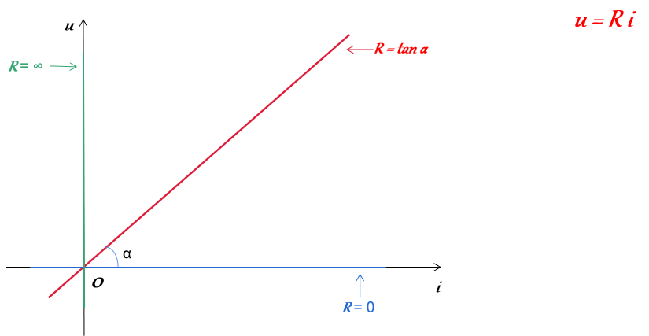

# 第二讲：电阻电路的基本分析方法

## 电阻器（Resistor）

### 电阻的含义

导体对电流的阻碍作用就叫该导体的电阻

### 符号

#### 图形符号

国内标准表示为：

国际推荐标准表示为：

#### 字母符号：R

### 欧姆定律

对于关联方向：u=Ri

对于非关联方向：u=-Ri

### 单位：Ω（欧姆）

## 电导（Conductance）

### 电导的含义

描述导体导电性能的物理量，即对于某一种导体允许电流通过它的容易性的量度。

### 符号：G

### 单位：S（西）（Siemens，西门子）

### 与电阻的关系

倒数关系：R = 1/G

### 欧姆定律

对于关联方向：i=Gu

∵ u=Ri，R = 1/G

∴ u=(1/G)i，i=Gu

对于非关联方向：i=-Gu

## 关联参考方向下线性电阻器的u-i关系

**在坐标系中表现为过原点和一三象限的一条直线（R = tan α）**

**α = 90° 时 R = ∞；**

**α = 0° 时 R = 0；**

