## 字母代表什么

| 字母 | 含义                     |
| ---: | :----------------------- |
|  U,u | 电压                     |
|  I,i | 电流                     |
|    R | 电阻                     |
|    φ | 电位                     |
|  q,Q | 电荷                     |
|  E,e | 电动势                   |
|  p,P | 功率                     |
|  w,W | 功、能量、功率的单位瓦特 |

## 什么是电厂

- 电厂：电场是电荷及变化磁场周围空间里存在的一种特殊物质。这种物质与通常的实物不同，它虽然不是由分子原子所组成的，但它却是客观存在的特殊物质，具有通常物质所具有的力和能量等客观属性。
- 电厂力：电场对放入其中的电荷有作用力。只要有电荷存在，电荷的周围就存在着电场，电场的基本性质是它对放入其中的电荷有力的作用，这种力就叫做电场力。

## 电压的变量

- 电荷（charge）
  
  - 含义：为物体或构成物体的质点所带的具有正电或负电的粒子，带正电的粒子叫正电荷（表示符号为“+”），带负电的粒子叫负电荷（表示符号为“﹣”）。也是某些基本粒子（如电子）的属性，同种电荷相互排斥，异种电荷相互吸引。（来自百度百科）
  - 符号：q
  - 单位：C（库伦，简称库）
  
- 电压（voltage）
  
  - 公式：u=dw/dq
  - 含义：**电场力移动单位电荷做的功**
  - 白话：电场力将单位正电荷从A移动到B所作的功
  - 单位：V(伏)
  - 表示符号：U，u
  - 常称为：电压降
  
- 电流（current）
  
  - 公式：i=dq/dt
  - 含义：**电荷的时间变化率**
  - 白话：单位时间内从A到B的正电荷量
  - 单位：A（安）
  - 表示符号：I，i
  - 电流又分为直流电流和交流电流
  
- 电位（potential）

  - 含义：**从某点到参考点的电压**
  - 单位：V(伏)
  - 表示符号：φ（/faɪ/）

- 磁通（flux）

- 电动势（eletromotive force）

	- 白话：非电厂力将单位正负荷从B移动到A所作的功

	- 单位：V(伏)

	- 表示符号：E

	- 电势力与电压的关系

		​	**Eba，电位的升高，Eba = φa - φb**

		​	Uab，电位的降低，Uab = φa - φb

		​	∴ Eba = Uab

		- Eba 与Uab的本质区别

			Eba 是内在属性

			Uab是为了分析电路所外加的变量

### 变量的大小写

- 不变的量大写
	- U,I
- 可能变化的量小写
	- u,i

### 思考1

已知

1. 任意两点之间有电压
2. 某点的**电位**是该点到参考点的电压

那么，两点之间的电压和两点的电位有什么关系？

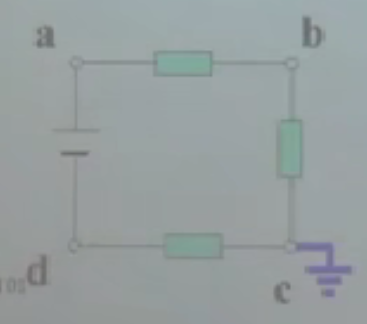

根据上图可得：

φc = 0

Uac = φa,Udc = φd

Uac = Uad + Udc (KVL)

Uad = Uac - Udc = φa - φd

结论：

1. **两点间的电压等于两点间的电位差**
2. 两点间的电位差称为**电位降**，电位降即两点间的电压又称为**电压降**

#### 例子：Uab = 1.5V，Ubc = 1.5V ，求 φa、φb、φc、Uac

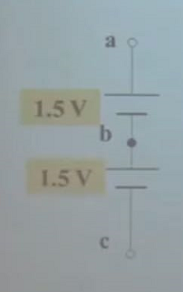

由于电位是根据参考点所计算的并且题目中为指定参考点那么

1. 设**a点为参考点**：φa=0

	Uab = φa - φb → φb = φa - Uab = 0 - 1.5 = -1.5V

	φb = -1.5V

	Ubc = φb - φc  → φc = φb - Ubc = -1.5 -1.5 = -3V

	φc = -3V

	Uac = φa - φc = 0 - (-3) = 3V

	**Uac = 3V**

2. 设**b点为参考点**：φb=0

	Uab = φa - φb → φa = φb + Uab = 0 + 1.5 = 1.5V

	φa = 1.5V

	Ubc = φb - φc  → φc = φb - Ubc = 0 - 1.5 = -1.5V

	φc = -1.5V

	Uac = φa - φc = 1.5 - (-1.5) = 3V

	**Uac = 3V**

3. 设**c点为参考点**：φc=0

	Ubc = φb - φc  → φb = φc + Ubc = 0 + 1.5 = 1.5V

	φb = 1.5V

	Uab = φa - φb → φa = φb + Uab = 1.5 + 1.5 = 3V

	φa = 3V

	Uac = φa = 3V

	**Uac = 3V**

通过例子可以看出不管以哪个点为参考点两点之间的电压不变，即**两点之间的电压与参考点无关**

## 电压和电流的参考方向

#### 为什么要有参考方向

- 电压和电流的方向不确定

	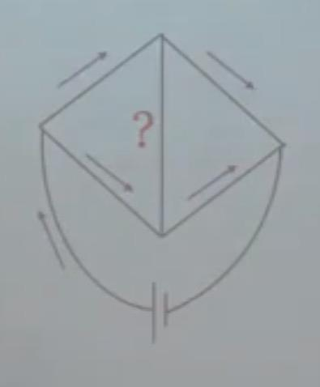

- 电压和电流的方向**随时间变化**(还不太理解)

	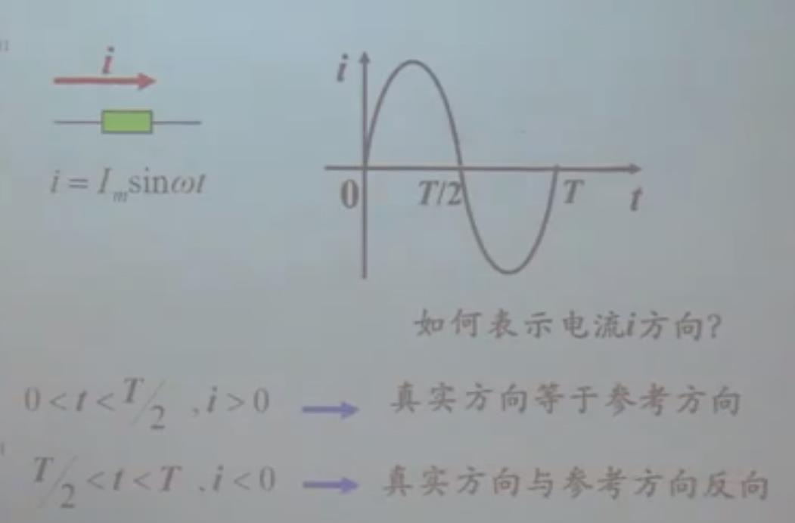

#### 电流的参考方向

表示电流参考方向的两种形式

- 箭头
- 双下标（iab）：参考方向从a指向b

由于不知道电流的方向所以要假设一个电流的参考方向（从左往右或从右往左都可以）

​	解出的数值如果是正值，那么真实方向与参考方向一致

​	解出的数值如果是负值，那么真实方向与参考方向相反

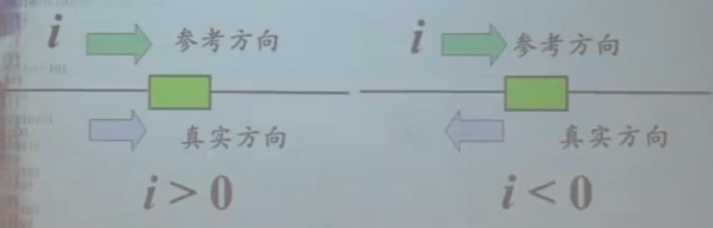

#### 电压的参考方向

表示电压参考方向的三种形式

- 箭头（认为**沿着箭头的方向是电压降**）

	

- 正负极性（推荐，认为**从正到负是电压降**）

	

- 双下标（Uab，认为**从a到b是电压降**）

	

#### 电动势的方向

表示电动势的方向的3种方式

- 箭头（认为**沿着箭头的方向是电压升**）

	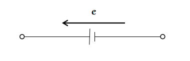

- 正负极性（推荐，认为**从负到正是电压升**）

	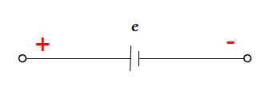

- 双下标（Eba，认为**从b到a是电压升**）

	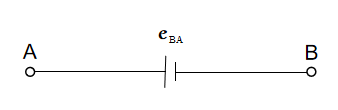

#### 二端元件上电压参考方向和电流参考方向的关系

##### 关联参考方向（电压、电流均以箭头方式表示，同一方向的为关联参考方向）

- 公式：u = Ri

- 形式：

	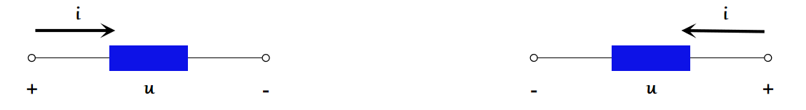

##### 非关联参考方向（电压、电流均以箭头方式表示，相反方向的为非关联参考方向）

- 公式：u = -Ri

- 形式：

	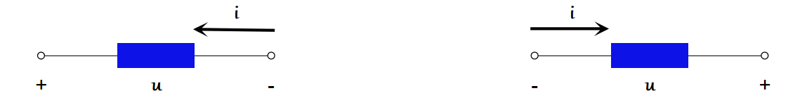

## 功率

- 含义：单位时间内从A到B所作的功
- 公式：P=dw/dt=(dw/dq)*(dq/dt) =ui
- 符号：P
- 单位：W（瓦特，简称瓦）

### 功率的计算

- 关联参考方向
	- P吸=ui ，元件吸收的功率
	- P吸>0，说明元件真正吸收功率
	- P吸<0，说明元件真正发出功率
- 非关联参考方向
	- 第一种
		- P发=ui ，元件发出的功率
		- P发>0，说明元件真正发出功率
		- P发<0，说明元件真正吸收功率
	- 第二种：将非关联参考方向改为关联参考方向使用P吸
		- P吸 = u(-i) = -ui ，元件吸收的功率

### 功率的计算记忆方式

- 第一种：关联参考方向 <=> P吸 = ui，非关联参考方向 <=> P发 = ui
- 第二种（永远只用P吸）：关联参考方向 <=> P吸 = ui，非关联参考方向 <=> P吸 = -ui

### 例题

例1、U = 10V，I = 1A 。U，I 为真实方向

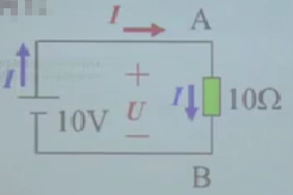

解：

方法1（使用第一种记忆方式）：

电压方向和电流方向对于电阻是关联方向，则 PR吸 = U × I = 10 × 1 = 10W ，电阻吸收功率：10W

电压方向和电流方向对于电阻是非关联方向，则 PU发 = U × I = 10 × 1 = 10W，电源发出功率：10W

方法2（使用第二种记忆方式）：

电压方向和电流方向对于电阻是关联方向，则 PR吸 = U × I = 10 × 1 = 10W ，电阻吸收功率：10W

电压方向和电流方向对于电阻是非关联方向，则 PU吸 = U × ( -I ) = 10 × -1 = -10W，电源发出功率：10W
